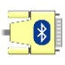
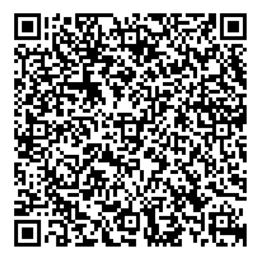
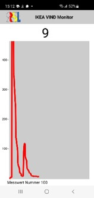

# IKEA-Feinstaubsensor VINDRIKTNING mit ESP32 per Bluetooth auf Smartphone anzeigen

IKEA bietet den Feinstaubsensor VINDRIKTNING an
[IKEA vindriktning](https://www.ikea.com/de/de/p/vindriktning-luftqualitaetssensor-70498242/)

Der Sensor misst den Feinstaub in der Luft und zeigt die Konzentration mit einer dreifarbigen LED Leiste an.  

Die Artikel von [heise](https://www.heise.de/ratgeber/Ikea-Feinstaubsensor-Vindriktning-zum-IoT-Device-aufbohren-6164149.html) und [Hypfer](https://github.com/Hypfer/esp8266-vindriktning-particle-sensor) beschreiben die Funktion des Ikea Sensors sowie die Methode, wie die Messdaten über die Serielle Schnittstelle abgegriffen werden können. Diese Artikel sind Grundlage für diesen Beitrag. Dank an die Autoren.

Es wird der ESP32 an Stelle des ESP8266 verwendet. Der ESP32 ermöglicht die Kommunikation mit einem Smartphone per Bluetooth anstelle des WLAN.  
Die Messdaten über Bluetooth können auf dem Smartphone mit einer App "von der Stange" als Zahlen dargestellt werden.  
Alternativ kann eine mit dem **MIT App Inventor** erstellte App genutzt oder auch angepasst werden, die die Daten in einer einfachen Grafik darstellt.

**Das ESP32-Programm kommuniziert über 'Bluetooth Classic' mit Apps ausschliesslich auf Android Smartphones. Das von Apple/IOS geforderte 'Blutooth BLE' wird aktuell nicht unterstützt.** 

---

## Datenfluss

*IKEA SENSOR --> ESP32*  
Der ESP32 empfängt die Daten des Sensors über seine serielle UART Schnittstelle.  
Der ESP32 interpretiert den Datenstrom und extrahiert daraus den Messwert.

*ESP32 --> Bluetooth*  
Der ESP32 sendet den Messwert als Zahlenstring über Bluetooth. (Mit einem führenden # Zeichen um den Start des Datenpakets zu markieren)

*Bluetooth --> Android Handy*  
Es gibt zwei Möglichkeiten, die Bluetooth Messwerte mit dem Handy zu empfangen und darzustellen:  

**Messerte anzeigen mit dem Serial Bluetooth Terminal**  
Die Standard-App aus dem Play Store zeigt nur Zahlenwerte

**Messwerte anzeigen mit IKEA VIND Monitor**  
Die eigens erstellte App zeigt die Messwerte in einer einfachen Grafik

---

## Hardware

Der IKEA Sensor wird mit einem Kreuzschlitz Schraubendreher geöffnet. Die serielle Schnittstelle des ESP32 wird mit dem IKEA Sensor verbunden.  
Dazu werden 3 Drähte an die IKEA Platine gelötet: GND, 5V und REST

Anleitung mit Fotos siehe [Hypfer](https://github.com/Hypfer/esp8266-vindriktning-particle-sensor)

Es werden verbunden  
ESP32-GND mit IKEA-GND  
ESP32-VIN mit IKEA-5V  
ESP32-Rx2 mit IKEA-REST (Über einen Spannungsteiler)

Es empfiehlt sich, den 5 Volt-Pegel des seriellen IKEA-REST Ausganssignals auf den 3,5 Volt Eingangpegel des ESP32-Rx2 abzusenken. Die geschieht mit Hilfe eines Spannungsteilers. 

[Spannungsteiler](https://github.com/PeterDirnhofer/IKEA-vindriktning-ESP32-Bluetooth/blob/ed034369126b07c1828fe7f08cb3ad05aead517b/images/Schematics.png)

---

## ESP32 Arduino Software

**Software Download so geht's**  
Navigieren zu [IKEA_ESP32.ino](https://github.com/PeterDirnhofer/IKEA-vintrikning-ESP32-Bluetooth/blob/main/IKEA_ESP32.ino)  
**raw** klicken  
**Rechtsklick | Seite speichern unter ..** speichert 'IKEA_ESP32.ino' auf dem Laptop.

In der Arduino-IDE unter 'Werkzeuge Board' das 'ESP32 Dev Module'  wählen. Wenn das Board nicht angeboten ist, muss noch der ESP32 Boardverwalter installiert werden.  Link siehe unten.

Hinweis:  
Sind in einer Arbeitsgruppe mehrere Nutzer\*innen auf engen Raum, muss - um Bluetooth-Konflikte zu vermeiden - jeder ESP32 seinen individuellen Bluetooth devicename besitzen.  
Dazu im Arduino Sketch den Bluetooth devicename 'BT_NAME' individuell pro ESP32 ändern.  
``#define BT_NAME "IKEA_BT_001"`` oder  
``#define BT_NAME "IKEA_BT_002"`` usw.

---

## Handy Software: 'Serial Bluetooth Terminal' - Zahlendarstellung

Die App 'Serial Bluetooth Terminal' kann aus dem Google Play Store geladen werden. Im Play Store Suche nach "serial bluetooth terminal"  
Die App zeigt die Messwerte aus dem ESP32 als String (mit führendem #-Zeichen)  

[Mess Bespiel](images/sreenshot_serial_bluetooth_terminal.jpg)

---

## Handy Grafik-App: 'IKEA VIND Monitor.app'

'IKEA VIND Monitor' ist eine App zur einfachen grafischen Darstellung der Messwerte.  

Die App wird auf dem Handy installiert durch Scannen dieses  QR Codes

Die App zeigt Messwerte grafisch in einer einfachen XY Darstellung. Im Beispiel wurden Kerzen ausgeblasen. Zunächst unmittelbar neben dem Sensor, dann im Abstand von 30 Zentimetern.  

---

## Handy Grafik-App: 'IKEA VIND Monitor.aia' bearbeiten

Es gibt die Möglichkeit, die App mit dem **MIT App Inventor** nachträglich zu bearbeiten und an die eigenen Vorstellungen anzupassen.

Eine schöne Einführung in den **MIT App Inventor** und die Installation gibt es unter  
[App Inventor Tutorial](https://youtu.be/aM2ktMKAunw)

Hinweis: Bei mir hat die Registrierung bei der Installation des 'MIT App Inventor' nur mit dem Google Account funktioniert, nicht per email Anmeldung.

---

### IKEA VIND Monitor.aia in 'MIT APP inventor' importieren

Zunächst wird die aia Datei von Github auf den Laptop heruntergeladen.  

Die Datei **IKEA_VIND_Monitor_2025.aia** findet sich im Verzeichnis SmartphoneApp. Mit Rechtsklick auf die Datei kann sie auf den Windows Computer geladen werden.

Den **MIT App Inventor** im Browser starten.  
**Import Projects from My Computer | Durchsuchen** und die gerade heruntergeladene Datei im Downloadfolder auswählen und in den 'MIT App Inventor' importieren.

---

# Hilfe

## Testumgebung: Stimulation des Sensors mit einer Kerze

Um beim Experimentieren den Sensor zu stimulieren kann man Zigarettenrauch vewenden. Es geht aber auch ohne Zigaretten: Der Rauch einer gerade ausgeblasenen Kerze in der Nähe treibt den Sensor locker in den roten Bereich und die Messwerte fallen dann langsam in ein, zwei Minuten wieder ab.

Bei den Versuchen ist auch etwas Geduld gefragt. Der Sensor schickt nur alle paar Sekunden Messdaten und dann gleich mehrere Pakete nacheinander. Die blaue LED am ESP32 zeigt an, wenn der ESP gerade Messdaten vom Sensor empfängt.

---

## Installation ESP32 Boardverwalter

So geht's  

'Datei | Voreinstellungen | Zusätzliche Bordverwalter'  
Diesen Link einfügen:  
``https://raw.githubusercontent.com/espressif/arduino-esp32/gh-pages/package_esp32_index.json``
